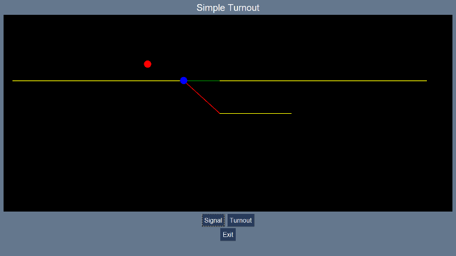

# mimic_panel_express

mimic_panel_express is a Python 3 library to enable schematic railway layouts to created with
a mimimum of coding.



```python
from mimic_panel_express import Track, Stub, Turnout, Signal

# Define the individual items
main = Track('Main Line', (25, 200), (1175, 200))
turnout = Turnout('Turnout', (500, 200))
siding = Stub('Siding', (600, 150), (800, 150))
signal = Signal('Signal', (400, 225))

# Create the layout and add the items
layout = Layout('Simple Turnout')
layout.add(main)
layout.add(signal)
layout.add(turnout)
layout.add(siding)

# Run the layout with all defaults
layout.run()
```
